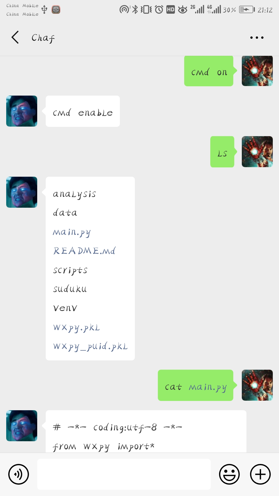
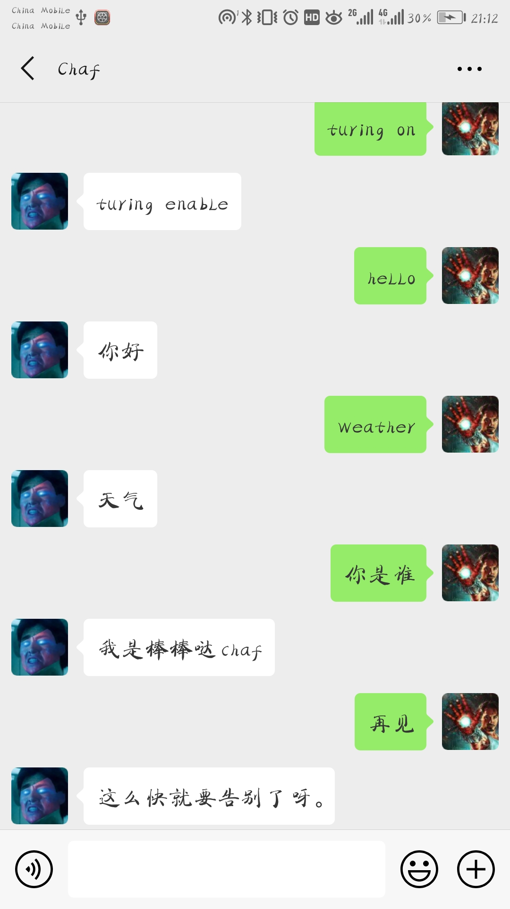
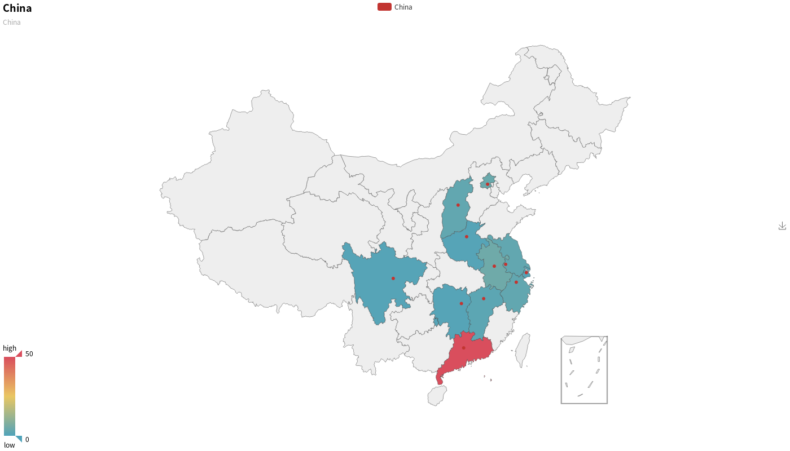
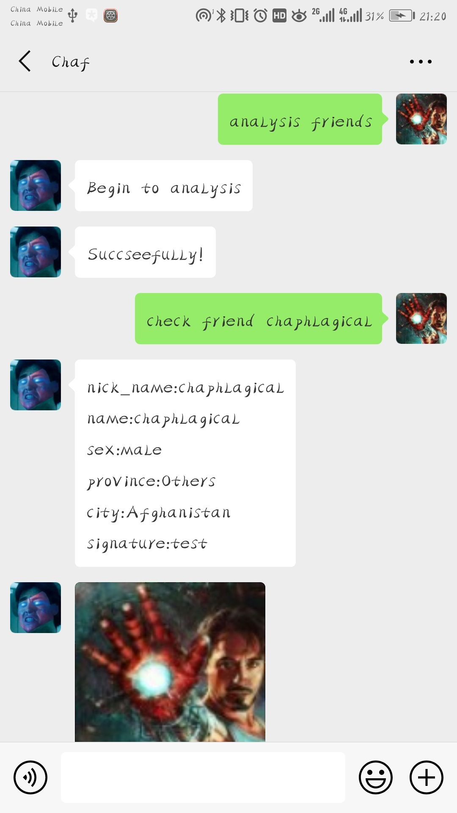
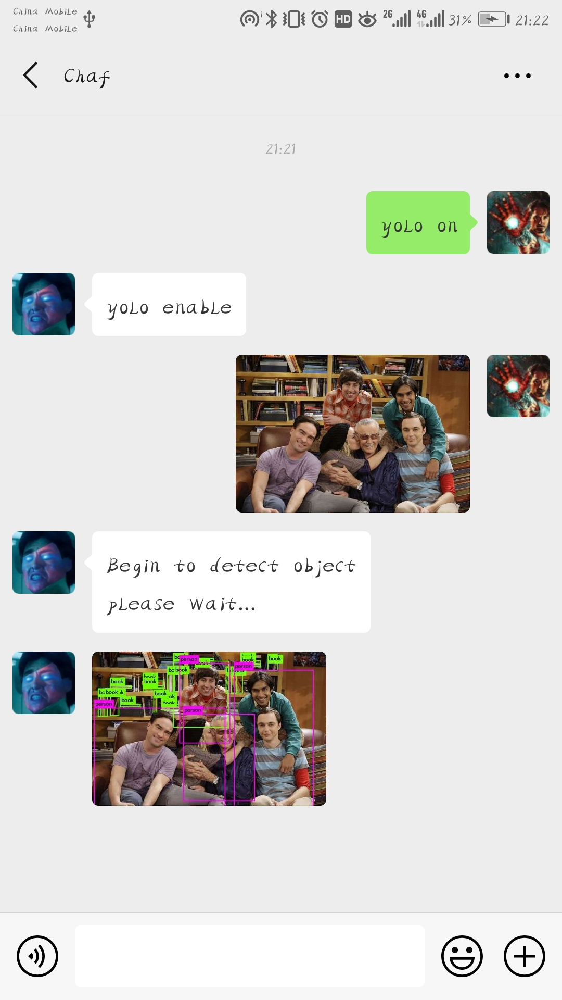
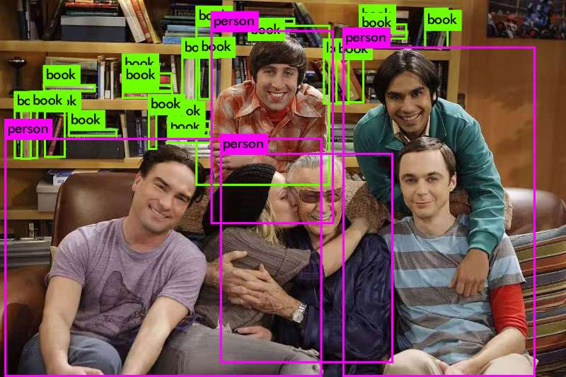

# WeChat Robot

This is a multifunction WeChat Robot based on wxpy. 

## Installation

* **Ubuntu 18.04/16.04 LTS**
* **Python 3.x**
* **pyecharts**
* **jieba**

## Introdution

### 1. WeChat Terminal

Using python operation system library os, you can control your computer through WeChat on your phone

#### Activate: 

```
cmd on
```

#### Inactivate:

```
cmd off
```

#### Kill

```
cmd kill
```

To prevent causing chaos, command terminal only available for the chats that has been activated.

#### Show the activated chats:

```
cmd list
```

After activating, you can control your computer through WeChat.

### **Result**



## 2. Turing Robot

Based on Turing Robot API (http://www.turingapi.com/), you can turn your WeChat to a chatting robot.

#### Activate: 

```
turing on
```

#### Inactivate:

```
turing off
```

#### kill:

```
turing kill
```

To prevent causing chaos, Turing Robot only available for the chats that has been activated.

#### Show the activated chats:

```
turing list
```

When someone talk to you or @you in a group, the robot will reply auto automatically.

### **Result**



## 3. Analysis friend circle

You can analysis your friend circle by some keywords.

### Analysis your friends:

```
analysis friends
```

or

```
friends analysis
```

The result will be saved in:

* ./data/user/user_friends_data.md
* ./data/user/avatar
* ./data/user/Graph/China.html
* ./data/user/Graph/Gender.html
* ./data/user/Graph/Signature.html
* ./data/user/Graph/province.html (The province most of your friends come from)

```
check friend [-friendname] # will show your friend basic information
```

### Analysis your groups:

If you want to analysis the specific group, you can post:

```
analysis [-group_name]
```

If you want to analysis all the groups, you can post:

```
analysis all group
```

The result will be saved in:

- ./data/group/[group_name]/group_members_data.md
- ./data/group/[group_name]/avatar
- ./data/group/[group_name]/Graph/Relationship.html

```
check friend [-groupname] # will show your group basic information
```

### **Result**

my WeChat friends's distribution ( .html had turn to .png):





## 4. Yolo object detection

Thanks to yolov3 (https://pjreddie.com/darknet/yolo/), the robot has integrated object detection function.

#### Activate:

```
yolo on
```

#### Inactivate:

```
yolo off
```

#### kill:

```
yolo kill
```

After activation, when you get a picture or a video, the yolo will run.





By the way, thank you Stan Lee.

## Solution

### 1.  Sometimes you may not be able to download file named after  Chinese characters. 

Open file " ../dist-packages/urllib3/fields.py"

Find: 

```python
value = email.utils.encode_rfc2231(value, 'utf-8')
value = '%s*=%s' % (name, value)
```

Edit the second line to:

```python
value = '%s="%s"' % (name, value.encode('utf-8'))
```

## Notice

Everyone can through keywords to control your WeChat robot, so be cautious about your privacy.