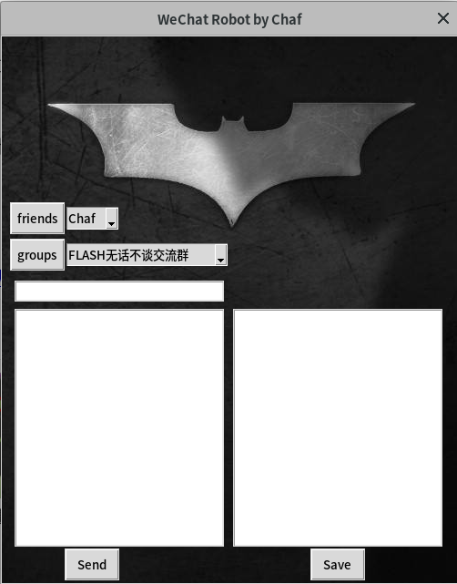

# WeChat Robot

This is a multifunction WeChat Robot based on wxpy. 

## Installation

* **Ubuntu 18.04/16.04 LTS**
* **Python 3.x**
* **pyecharts**
* **jieba**
* **OpenCV  (version>=3)**
* **Keras**

## Introdution

### 1. WeChat Terminal

Using python operation system library os, you can control your computer through WeChat on your phone

#### Activate: 

```
cmd on
```

#### Inactivate:

```
cmd off
```

#### Kill

```
cmd kill
```

To prevent causing chaos, command terminal only available for the chats that has been activated.

#### Show the activated chats:

```
cmd list
```

After activating, you can control your computer through WeChat.

### **Result**

<p align="left"> <p align="left">

## 2. Turing Robot

Based on Turing Robot API (http://www.turingapi.com/), you can turn your WeChat to a chatting robot.

#### Activate: 

```
turing on
```

#### Inactivate:

```
turing off
```

#### kill:

```
turing kill
```

To prevent causing chaos, Turing Robot only available for the chats that has been activated.

#### Show the activated chats:

```
turing list
```

When someone talk to you or @you in a group, the robot will reply auto automatically.

### **Result**

<p align="left"> <p align="left">

## 3. Analysis friend circle

You can analysis your friend circle by some keywords.

### Analysis your friends:

```
analysis friends
```

The result will be saved in:

* ./data/user/user_friends_data.md
* ./data/user/avatar
* ./data/user/Graph/China.html
* ./data/user/Graph/Gender.html
* ./data/user/Graph/Signature.html
* ./data/user/Graph/province.html (The province most of your friends come from)

```
check friend [-friendname] # will show your friend basic information
```

### Analysis your groups:

If you want to analysis the specific group, you can post:

```
analysis group [-group_name]
```

If you want to analysis all the groups, you can post:

```
analysis all group
```

The result will be saved in:

- ./data/group/[group_name]/group_members_data.md
- ./data/group/[group_name]/avatar
- ./data/group/[group_name]/Graph/Relationship.html

```
check group [-groupname] # will show your group basic information
```

### **Result**

my WeChat friends's distribution ( .html had turn to .png):

<p align="left">  <p align="left">


## 4. Yolo object detection

Thanks to yolov3 (https://pjreddie.com/darknet/yolo/), the robot has integrated object detection function.

#### Activate:

```
yolo on
```

#### Inactivate:

```
yolo off
```

#### kill:

```
yolo kill
```

After activation, when you get a picture or a video, the yolo will run.

<p align="left">  <p align="left">

By the way, thank you Stan Lee.

## 5. Shazam !

Using PRNet (ECCV2018 https://github.com/YadiraF/PRNet) to achieve face swapping, Everyone can be Shazam !

 #### Activate:

```
hero on
```

#### Inactivate:

```
hero off
```

#### kill:

```
hero kill
```

After activation, you just need to post shazam after post a picture first.

The result like this:

<p align="left">  <p align="left">

Actually you can put your own super hero photo in ./analysis/CV/PRNet/Hero/material/, post the name after posting a photo, you can also get result. 

## 6、Movie download_link

Using requests, urllib and re, obtaining the url of the movie resource from https://www.ygdy8.com/ automatically

You just need to post:

```
movie [-movie_name]
```

and you will get all the url. 

<p align="left">  <p align="left">

## 7、PC Wechat


<p align="left">  <p align="left">

Supporting sending message, receiving message and saving chats history.

## Solution

### 1.  Sometimes you may not be able to download file named after  Chinese characters. 

Open file " ../dist-packages/urllib3/fields.py"

Find: 

```python
value = email.utils.encode_rfc2231(value, 'utf-8')
value = '%s*=%s' % (name, value)
```

Edit the second line to:

```python
value = '%s="%s"' % (name, value.encode('utf-8'))
```

## Notice

Everyone can through keywords to control your WeChat robot, so be cautious about your privacy.

## Update

#### **3/13/2019** Simplify the structure